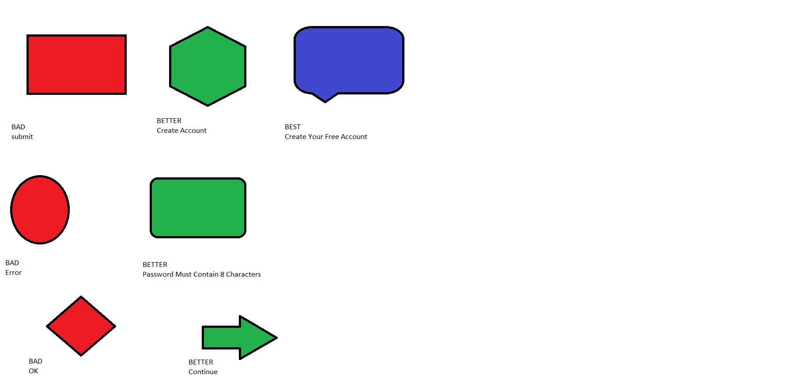
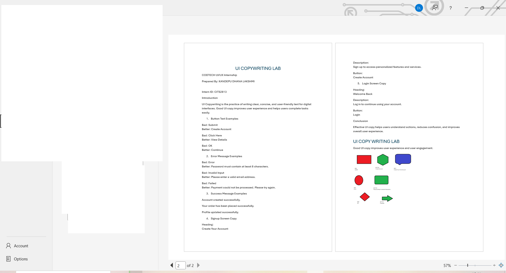

# CODTECH UI/UX Internship Task-3

## UI Copywriting Lab

Company: CODTECH IT SOLUTIONS

Intern Name: KANDEPU DHANA LAKSHMI

Intern ID: CITS2813

Domain: UI/UX Design

Duration: 8 Weeks

Mentor Name: Neela Santosh Kumar

## Objective

The objective of this project is to create effective UI copy examples for buttons, forms, error messages, and user interactions.

## Description

This project demonstrates how well-written UI text improves usability and user experience. Examples include button labels, success messages, error messages, and login/signup screen content.

## Tools Used

* Microsoft Word
* Paint

## Files in Repository

* UI Copywriting Lab Report.pdf
* ui-copy-example.png
* proof1.png
* README.md

## Conclusion

Clear and concise UI copy helps users understand actions quickly and improves overall interface usability.

## Proof of Execution

### Proof 1 - UI Copy Example

### Proof 2 - Report Screenshot

